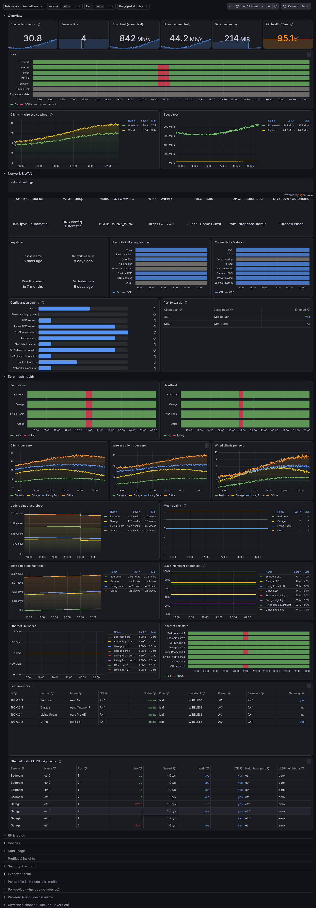

<div align="center">

# 🌐 Eero Prometheus Exporter

**Keep an eye on your mesh network like never before**

[](https://python.org)
[](https://pypi.org/project/eero-prometheus-exporter/)
[](LICENSE)
[](https://prometheus.io)
[](https://docker.com)

---

_A modern, async Prometheus exporter for your eero mesh WiFi network._  
_Monitor network health, device connectivity, speed tests, and 115+ metrics with ease._

[Get Started](../../wiki/Installation) · [Metrics](../../wiki/Metrics) · [Docker](../../wiki/Docker) · [Documentation](../../wiki)

</div>

---

## 📸 Dashboard Preview

<div align="center">



*Eero Mesh Network Grafana Dashboard - Real-time monitoring of network status, device health, and connectivity*

</div>

---

## ✨ Why This Project?

Your eero mesh network is the backbone of your connected home. Shouldn't you be able to monitor it properly?

This exporter gives you **real-time insights** into your network's performance, device health, and connectivity—all exposed as Prometheus metrics ready for your favorite dashboards.

### What You Get

| Feature | Description |
|---------|-------------|
| 📊 **115+ Metrics** | Network, eero hardware, devices, Ethernet ports, Thread, Eero Plus & more |
| ⚡ **Async Architecture** | Non-blocking I/O for efficient, lightweight collection |
| 🔗 **Async API Client** | Powered by [eero-api](https://github.com/fulviofreitas/eero-api) |
| 🔐 **Secure Auth** | Session-based authentication with secure local storage |
| 🐳 **Docker Ready** | Multi-stage build with minimal image footprint |
| 🎨 **Beautiful CLI** | Rich terminal output with colors and progress indicators |
| 📈 **Grafana Compatible** | Perfect for building stunning dashboards |
| 💎 **Eero Plus Support** | Activity tracking, backup network, and premium feature metrics |

---

## 🚀 Quick Start

```bash
pip install eero-prometheus-exporter
eero-exporter login your-email@example.com
eero-exporter serve
```

Metrics live at **http://localhost:10052/metrics**

---

## 📚 Documentation

Full documentation in the **[Wiki](../../wiki)** — [Installation](../../wiki/Installation) · [Docker](../../wiki/Docker) · [CLI](../../wiki/CLI-Reference) · [Configuration](../../wiki/Configuration) · [Troubleshooting](../../wiki/Troubleshooting)

---

## 📄 License

[MIT](LICENSE) — Use it, fork it, build cool stuff 🎉

---

<div align="center">

## 📊 Repository Metrics


</div>
